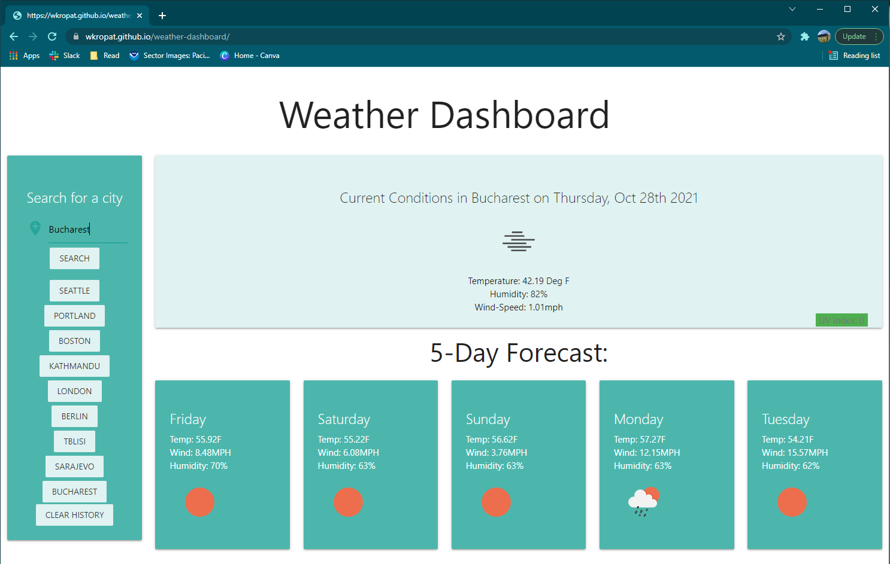

# Weather Dashboard
## Description
This website shows current weather and forecast for a given city. There is a search form with a history below it, a card for current weather, and cards for 5 day forecast. This project uses moment.js to render times, the materialze css framwork, and the OpenWeatherMap API to get weather data.

## Table of Contents
  * [Installation](#installation)
  * [Usage](#usage)
  * [Testing](#testing)
  * [Questions](#questions)
  * [License](#license)
    
    
## Installation
    
  _Instructions for installation:_
  No installation, it is a live website
      
## Usage
  _Instructions for use:_ Search for a city in the form, and cards with current and future weather will automatically generate. There is a color coded UV index badge, cards for current and next five day weather, and a button for each item in search history. Additionally, there is a clear search history button to get rid of the links in the left hand nav card.
  
 [Visit the live website here](https://wkropat.github.io/weather-dashboard/)
        
## Screenshot

      
## Contribution
  _Are contributions welcome?_
  No
      
## Testing
  _Instructions for testing application:_
  No tests written. If the user inputs something other than a city, nothing happens. This would be fixed in future work.
  
      
## Questions
      
  _For further questions:_
  Email me at:
  
  _Contact Info:_
  GitHub: [wkropat](https://github.com/wkropat)
  Email: [wkropat@gmail.com](mailto:wkropat@gmail.com)
    
## License
      
  _This application uses the MIT License license._
      
  For more information please view the [license description](https://choosealicense.com/licenses/mit/).
  
  
